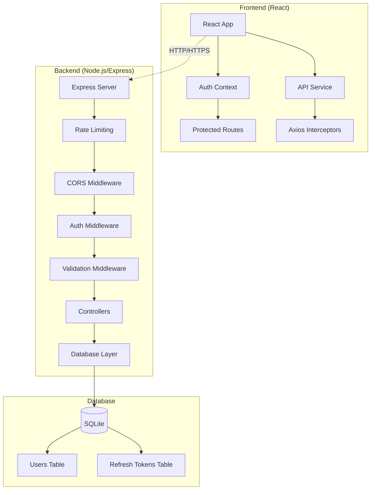
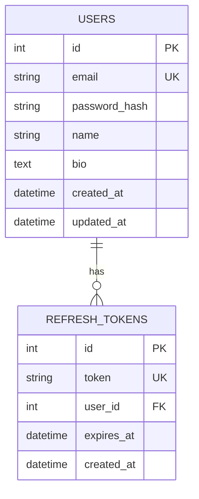
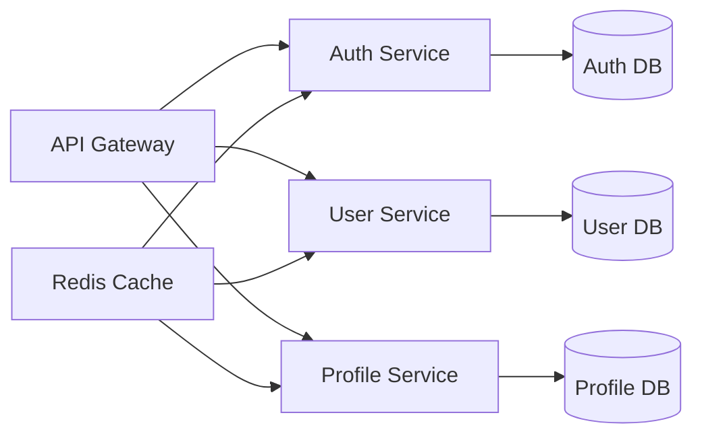

# Architecture Documentation

This document outlines the architectural decisions, security measures, and scaling considerations for the Colbin User Management System.

## System Overview

Colbin is a full-stack web application built with a modern, scalable architecture:

- **Frontend**: React.js with modern hooks and context API
- **Backend**: Node.js with Express.js framework
- **Database**: SQLite for development (easily upgradeable to PostgreSQL/MySQL)
- **Authentication**: JWT with access/refresh token pattern
- **Security**: BCrypt password hashing, rate limiting, input validation

## Architecture Diagram



## Architectural Decisions

### 1. **Separation of Concerns**

**Decision**: Clean separation between frontend and backend with RESTful API
**Rationale**: 
- Enables independent scaling and deployment
- Allows multiple client applications (web, mobile, desktop)
- Facilitates team collaboration and parallel development
- Easier testing and maintenance

### 2. **JWT Authentication with Refresh Tokens**

**Decision**: Dual-token authentication system (access + refresh tokens)
**Rationale**:
- **Security**: Short-lived access tokens (15 minutes) limit exposure
- **User Experience**: Refresh tokens (7 days) prevent frequent re-authentication
- **Stateless**: No server-side session storage required
- **Scalability**: Tokens can be verified without database queries

### 3. **SQLite for Development**

**Decision**: SQLite as the default database
**Rationale**:
- **Simplicity**: No additional database server setup required
- **Portability**: Single file database, easy to backup and migrate
- **Development Speed**: Zero configuration for local development
- **Migration Path**: Easy to upgrade to PostgreSQL/MySQL for production

### 4. **React Context for State Management**

**Decision**: React Context API instead of Redux
**Rationale**:
- **Simplicity**: Sufficient for current application complexity
- **Built-in**: No additional dependencies
- **Performance**: Adequate for user authentication state
- **Maintainability**: Easier to understand and debug

### 5. **Tailwind CSS for Styling**

**Decision**: Utility-first CSS framework
**Rationale**:
- **Consistency**: Design system approach
- **Performance**: Purged CSS in production
- **Developer Experience**: Rapid prototyping and development
- **Maintainability**: Reduced custom CSS complexity

## Security Measures

### 1. **Password Security**

```javascript
// BCrypt with 12 rounds (2^12 = 4096 iterations)
const saltRounds = 12;
const passwordHash = await bcrypt.hash(password, saltRounds);
```

**Measures**:
- BCrypt hashing with 12 salt rounds
- Password complexity requirements (8+ chars, mixed case, numbers)
- No password storage in plaintext anywhere
- Secure password comparison using bcrypt.compare()

### 2. **JWT Token Security**

**Access Tokens**:
- Short expiration (15 minutes)
- Signed with strong secret (256-bit recommended)
- Contains minimal user information (user ID only)
- Transmitted via Authorization header

**Refresh Tokens**:
- Longer expiration (7 days)
- Stored in database with expiration tracking
- Single-use (invalidated after refresh)
- Separate signing secret from access tokens

### 3. **API Security**

```javascript
// Rate limiting
const limiter = rateLimit({
  windowMs: 15 * 60 * 1000, // 15 minutes
  max: 100, // limit each IP to 100 requests per windowMs
});

// Authentication rate limiting
const authLimiter = rateLimit({
  windowMs: 15 * 60 * 1000,
  max: 5, // 5 auth attempts per 15 minutes
});
```

**Measures**:
- Rate limiting (100 requests/15min general, 5 auth attempts/15min)
- CORS configuration with specific origins
- Helmet.js for security headers
- Input validation and sanitization
- SQL injection prevention (parameterized queries)
- XSS protection through input validation

### 4. **Frontend Security**

**Measures**:
- Secure token storage (localStorage with awareness of limitations)
- Automatic token refresh with retry logic
- Protected route implementation
- Input validation on client side
- HTTPS enforcement in production

### 5. **Environment Security**

**Development**:
```env
JWT_ACCESS_SECRET=dev-secret-change-in-production
JWT_REFRESH_SECRET=dev-refresh-secret-change-in-production
```

**Production**:
```bash
# Generate strong secrets
openssl rand -hex 64
```

**Measures**:
- Environment variable separation
- Strong secret generation for production
- Database path configuration
- CORS origin restrictions

## Error Handling Strategy

### 1. **Structured Error Responses**

```javascript
// Consistent error format
{
  "error": "Human-readable error message",
  "code": "MACHINE_READABLE_CODE",
  "details": [/* validation errors */]
}
```

### 2. **Error Categories**

- **400 Bad Request**: Client input validation errors
- **401 Unauthorized**: Authentication failures
- **403 Forbidden**: Authorization failures
- **404 Not Found**: Resource not found
- **429 Too Many Requests**: Rate limiting
- **500 Internal Server Error**: Server errors

### 3. **Client-Side Error Handling**

```javascript
// Automatic token refresh on 401 errors
axios.interceptors.response.use(
  response => response,
  async error => {
    if (error.response?.status === 401 && !originalRequest._retry) {
      // Attempt token refresh
      return refreshTokenAndRetry(error.config);
    }
    return Promise.reject(error);
  }
);
```

## Database Design

### Schema Design Principles

1. **Normalization**: Proper table relationships with foreign keys
2. **Indexing**: Email field indexed for fast lookups
3. **Constraints**: Unique constraints on email, required field validation
4. **Timestamps**: Automatic created_at and updated_at tracking
5. **Data Integrity**: Foreign key constraints with CASCADE delete

### Entity Relationship Diagram



### Migration Strategy

```sql
-- Future PostgreSQL migration
CREATE TABLE users (
    id SERIAL PRIMARY KEY,
    email VARCHAR(255) UNIQUE NOT NULL,
    password_hash VARCHAR(255) NOT NULL,
    name VARCHAR(100),
    bio TEXT,
    created_at TIMESTAMP DEFAULT CURRENT_TIMESTAMP,
    updated_at TIMESTAMP DEFAULT CURRENT_TIMESTAMP
);

CREATE INDEX idx_users_email ON users(email);
```

## Scaling Considerations

### 1. **Horizontal Scaling**

**Current Limitations**:
- SQLite doesn't support concurrent writes
- In-memory rate limiting per instance

**Solutions**:
- Migrate to PostgreSQL/MySQL
- Redis for session/rate limiting storage
- Load balancer with session affinity

### 2. **Microservices Architecture**

**Service Breakdown**:


**Benefits**:
- Independent scaling per service
- Technology diversity (different languages/frameworks)
- Fault isolation
- Team autonomy

### 3. **Caching Strategy**

**Current State**: No caching implemented
**Recommendations**:

```javascript
// Redis caching example
const redis = require('redis');
const client = redis.createClient();

// Cache user profiles
const getUserProfile = async (userId) => {
  const cached = await client.get(`user:${userId}`);
  if (cached) return JSON.parse(cached);
  
  const user = await db.getUserById(userId);
  await client.setex(`user:${userId}`, 300, JSON.stringify(user)); // 5min cache
  return user;
};
```

### 4. **Database Scaling**

**Read Replicas**:
```javascript
// Master-slave configuration
const masterDB = new Database(process.env.MASTER_DB_URL);
const replicaDB = new Database(process.env.REPLICA_DB_URL);

// Route reads to replica
const getUser = (id) => replicaDB.query('SELECT * FROM users WHERE id = ?', [id]);
const updateUser = (id, data) => masterDB.query('UPDATE users SET ... WHERE id = ?', [data, id]);
```

**Sharding Strategy**:
- User ID based sharding
- Geographic sharding
- Feature-based sharding

### 5. **Performance Optimization**

**Backend Optimizations**:
- Connection pooling
- Query optimization
- Response compression (gzip)
- CDN for static assets
- Image optimization and resizing

**Frontend Optimizations**:
- Code splitting with React.lazy()
- Bundle optimization
- Service worker for caching
- Progressive Web App features

### 6. **Monitoring and Observability**

**Recommended Stack**:
- **Logging**: Winston + ELK Stack (Elasticsearch, Logstash, Kibana)
- **Metrics**: Prometheus + Grafana
- **Tracing**: Jaeger for distributed tracing
- **Error Tracking**: Sentry
- **Uptime Monitoring**: Pingdom/DataDog

**Implementation Example**:
```javascript
const winston = require('winston');
const logger = winston.createLogger({
  level: 'info',
  format: winston.format.combine(
    winston.format.timestamp(),
    winston.format.json()
  ),
  transports: [
    new winston.transports.File({ filename: 'error.log', level: 'error' }),
    new winston.transports.File({ filename: 'combined.log' })
  ]
});
```

### 7. **Deployment Strategy**

**Containerization**:
```dockerfile
# Multi-stage Docker build
FROM node:18-alpine AS builder
WORKDIR /app
COPY package*.json ./
RUN npm ci --only=production

FROM node:18-alpine AS runtime
WORKDIR /app
COPY --from=builder /app/node_modules ./node_modules
COPY . .
EXPOSE 3001
CMD ["npm", "start"]
```

**Kubernetes Deployment**:
```yaml
apiVersion: apps/v1
kind: Deployment
metadata:
  name: colbin-api
spec:
  replicas: 3
  selector:
    matchLabels:
      app: colbin-api
  template:
    metadata:
      labels:
        app: colbin-api
    spec:
      containers:
      - name: api
        image: colbin/api:latest
        ports:
        - containerPort: 3001
        env:
        - name: NODE_ENV
          value: "production"
        - name: JWT_ACCESS_SECRET
          valueFrom:
            secretKeyRef:
              name: jwt-secrets
              key: access-secret
```

**CI/CD Pipeline**:
1. Code commit triggers build
2. Automated testing (unit, integration, e2e)
3. Security scanning (SAST, dependency check)
4. Build Docker images
5. Deploy to staging environment
6. Run smoke tests
7. Deploy to production with blue-green deployment

### 8. **Security at Scale**

**Additional Measures**:
- Web Application Firewall (WAF)
- DDoS protection
- Certificate management (Let's Encrypt automation)
- Security headers (CSP, HSTS, etc.)
- Regular security audits and penetration testing
- Dependency vulnerability scanning
- Secrets management (HashiCorp Vault, AWS Secrets Manager)

## Future Enhancements

### Short Term (1-3 months)
- [ ] Email verification for registration
- [ ] Password reset functionality
- [ ] User profile avatars
- [ ] Enhanced input validation
- [ ] API documentation with Swagger
- [ ] Comprehensive test suite

### Medium Term (3-6 months)
- [ ] Redis integration for caching and sessions
- [ ] PostgreSQL migration
- [ ] Real-time notifications
- [ ] Admin dashboard
- [ ] Audit logging
- [ ] Multi-factor authentication (2FA)

### Long Term (6+ months)
- [ ] Microservices architecture
- [ ] OAuth2/OpenID Connect integration
- [ ] Mobile app development
- [ ] Advanced analytics and reporting
- [ ] Machine learning features (user behavior analysis)
- [ ] Multi-tenancy support

## Conclusion

The current architecture provides a solid foundation for a user management system with room for growth. The modular design, security-first approach, and clear separation of concerns make it suitable for both small applications and enterprise-scale deployments with appropriate scaling strategies.
