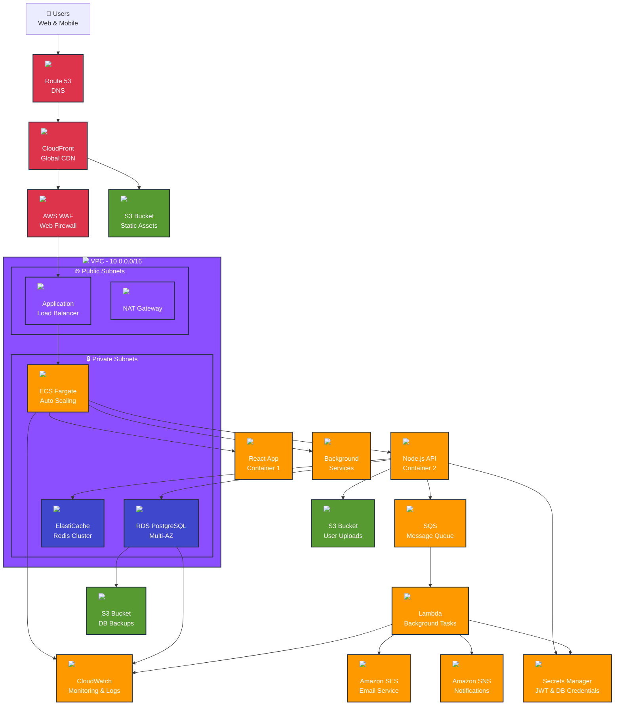

# Colbin - User Management System

<div align="center">
  
  
  
  
  
</div>

A modern, secure user management system built with Node.js, Express, SQLite, and React. Features JWT authentication, user profiles, and a beautiful responsive interface designed for cloud-scale deployment.

## 🚀 Features

- **Secure Authentication**: BCrypt password hashing and JWT tokens with automatic refresh
- **User Registration**: Email validation and secure password requirements
- **Profile Management**: Complete user profile CRUD operations
- **Responsive Design**: Modern, mobile-first UI built with Tailwind CSS
- **Token Management**: Automatic token refresh and secure logout
- **Input Validation**: Comprehensive client and server-side validation
- **Error Handling**: Proper error handling with user-friendly messages
- **Rate Limiting**: Built-in protection against brute force attacks
- **Cloud Ready**: Designed for AWS scalable deployment

## 🏗️ AWS Scalable Architecture

<div align="center">



</div>

### 🏢 Architecture Components

<table>
<tr>
<td width="50%">

#### 🌐 **Frontend & CDN**
- **Route 53**: DNS management and health checks
- **CloudFront**: Global CDN with edge locations
- **S3**: Static asset hosting with versioning
- **WAF**: Web Application Firewall protection

#### ⚡ **Compute & Containers**
- **ECS Fargate**: Serverless container platform
- **Application Load Balancer**: Layer 7 load balancing
- **Auto Scaling**: Dynamic scaling based on metrics
- **Lambda**: Serverless background processing

</td>
<td width="50%">

#### 🗄️ **Data & Storage**
- **RDS PostgreSQL**: Managed database with Multi-AZ
- **ElastiCache Redis**: In-memory caching layer
- **S3**: Object storage for files and backups
- **Secrets Manager**: Secure credential storage

#### 🔐 **Security & Monitoring**
- **VPC**: Isolated network environment
- **CloudWatch**: Comprehensive monitoring
- **SES/SNS**: Communication services
- **IAM**: Fine-grained access control

</td>
</tr>
</table>

## 📋 Requirements

- Node.js (v16 or higher)
- npm or yarn
- Modern web browser
- AWS Account (for cloud deployment)

## 🛠️ Installation & Setup

### 1. Clone the repository
```bash
git clone <repository-url>
cd Colbin
```

### 2. Backend Setup
```bash
cd backend
npm install

# Copy environment variables
cp env.example .env

# Edit .env file with your configuration
# IMPORTANT: Change JWT secrets in production!
```

### 3. Frontend Setup
```bash
cd ../frontend
npm install

# Copy environment variables
cp env.example .env

# Install Tailwind CSS
npm install -D tailwindcss postcss autoprefixer
```

### 4. Start the Application

**Terminal 1 - Backend:**
```bash
cd backend
npm run dev
```

**Terminal 2 - Frontend:**
```bash
cd frontend
npm start
```

The application will be available at:
- Frontend: http://localhost:3000
- Backend API: http://localhost:3001

## 📁 Project Structure

```
Colbin/
├── backend/
│   ├── config/
│   │   └── database.js          # SQLite database configuration
│   ├── controllers/
│   │   ├── authController.js    # Authentication logic
│   │   └── userController.js    # User profile management
│   ├── middleware/
│   │   ├── auth.js              # JWT authentication middleware
│   │   └── validation.js        # Input validation middleware
│   ├── routes/
│   │   ├── auth.js              # Authentication routes
│   │   └── user.js              # User profile routes
│   ├── database/                # SQLite database files
│   ├── server.js                # Express server setup
│   ├── package.json
│   └── env.example
│
├── frontend/
│   ├── public/
│   ├── src/
│   │   ├── components/
│   │   │   ├── Navbar.js        # Navigation component
│   │   │   └── ProtectedRoute.js # Route protection
│   │   ├── context/
│   │   │   └── AuthContext.js   # Authentication state management
│   │   ├── pages/
│   │   │   ├── Home.js          # Landing page
│   │   │   ├── Login.js         # Login form
│   │   │   ├── Register.js      # Registration form
│   │   │   └── Profile.js       # User profile page
│   │   ├── services/
│   │   │   └── api.js           # API client with interceptors
│   │   ├── App.js
│   │   ├── App.css
│   │   └── index.js
│   ├── tailwind.config.js
│   ├── package.json
│   └── env.example
│
├── docs/                        # Documentation
├── README.md
└── ARCHITECTURE.md
```

## 🔐 Environment Variables

### Backend (.env)
```env
PORT=3001
NODE_ENV=development
JWT_ACCESS_SECRET=your-super-secret-access-token-key
JWT_REFRESH_SECRET=your-super-secret-refresh-token-key
JWT_ACCESS_EXPIRES_IN=15m
JWT_REFRESH_EXPIRES_IN=7d
DB_PATH=./database/users.db
FRONTEND_URL=http://localhost:3000
```

### Frontend (.env)
```env
REACT_APP_API_URL=http://localhost:3001/api
GENERATE_SOURCEMAP=false
```

## 📊 Database Schema

The application uses SQLite with the following tables:

### Users Table
```sql
CREATE TABLE users (
  id INTEGER PRIMARY KEY AUTOINCREMENT,
  email TEXT UNIQUE NOT NULL,
  password_hash TEXT NOT NULL,
  name TEXT,
  bio TEXT,
  created_at DATETIME DEFAULT CURRENT_TIMESTAMP,
  updated_at DATETIME DEFAULT CURRENT_TIMESTAMP
);
```

### Refresh Tokens Table
```sql
CREATE TABLE refresh_tokens (
  id INTEGER PRIMARY KEY AUTOINCREMENT,
  token TEXT UNIQUE NOT NULL,
  user_id INTEGER NOT NULL,
  expires_at DATETIME NOT NULL,
  created_at DATETIME DEFAULT CURRENT_TIMESTAMP,
  FOREIGN KEY (user_id) REFERENCES users (id) ON DELETE CASCADE
);
```

## 🔗 API Documentation

See [API_DOCS.md](docs/API_DOCS.md) for detailed API documentation including endpoints, request/response examples, and error codes.

## 🧪 Testing

### Backend Tests
```bash
cd backend
npm test
```

### Frontend Tests
```bash
cd frontend
npm test
```

## ☁️ AWS Deployment Guide

### Prerequisites
- AWS CLI configured
- Docker installed
- Terraform (optional, for IaC)

### Deployment Steps

1. **Container Registry**
```bash
# Create ECR repositories
aws ecr create-repository --repository-name colbin-frontend
aws ecr create-repository --repository-name colbin-backend

# Build and push images
docker build -t colbin-frontend ./frontend
docker build -t colbin-backend ./backend
```

2. **Infrastructure Setup**
```bash
# Create VPC, subnets, security groups
# Set up RDS PostgreSQL instance
# Configure ElastiCache Redis cluster
# Create ECS cluster and task definitions
```

3. **Environment Configuration**
```bash
# Store secrets in AWS Secrets Manager
aws secretsmanager create-secret --name colbin/jwt-secrets
aws secretsmanager create-secret --name colbin/db-credentials
```

### Security Checklist
- [ ] Enable AWS WAF with custom rules
- [ ] Configure VPC with private subnets
- [ ] Set up SSL/TLS certificates
- [ ] Enable CloudTrail logging
- [ ] Configure backup strategies
- [ ] Set up monitoring and alerts

## 🚀 Production Deployment

### Environment Setup
1. Set `NODE_ENV=production` in backend
2. Generate strong JWT secrets (use `openssl rand -hex 64`)
3. Configure proper CORS origins
4. Set up HTTPS
5. Configure rate limiting for production

### Docker Deployment
```bash
# Build and run with Docker Compose
docker-compose up -d
```

## 🤝 Contributing

1. Fork the repository
2. Create a feature branch (`git checkout -b feature/amazing-feature`)
3. Commit your changes (`git commit -m 'Add some amazing feature'`)
4. Push to the branch (`git push origin feature/amazing-feature`)
5. Open a Pull Request

## 📄 License

This project is licensed under the MIT License - see the [LICENSE](LICENSE) file for details.

## 🆘 Support

If you encounter any issues or have questions:
1. Check the [API Documentation](docs/API_DOCS.md)
2. Review the [Architecture Guide](ARCHITECTURE.md)
3. Open an issue on GitHub

## 🙏 Acknowledgments

<div align="center">
  
  
  
  
</div>

- Built with [Express.js](https://expressjs.com/)
- UI components styled with [Tailwind CSS](https://tailwindcss.com/)
- Authentication powered by [JWT](https://jwt.io/)
- Database powered by [SQLite](https://www.sqlite.org/)
- Cloud infrastructure on [AWS](https://aws.amazon.com/)