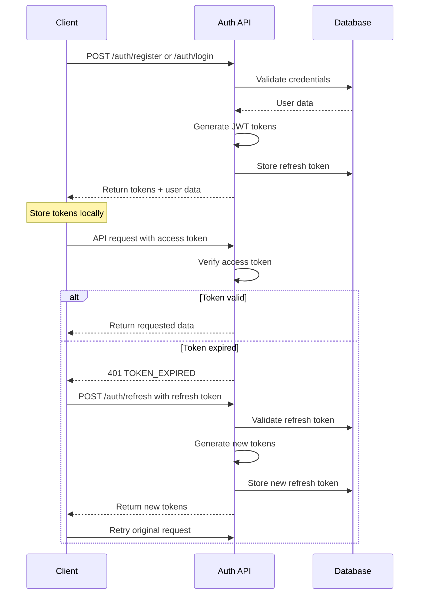

# API Documentation

This document provides comprehensive documentation for the Colbin User Management System API.

## Base URL

```
http://localhost:3001/api
```

## Authentication

The API uses JWT (JSON Web Tokens) for authentication. Most endpoints require a valid access token in the Authorization header:

```
Authorization: Bearer <access_token>
```

### Token Types
- **Access Token**: Short-lived (15 minutes) token for API access
- **Refresh Token**: Long-lived (7 days) token for obtaining new access tokens

## Rate Limiting

- **General API**: 100 requests per 15 minutes per IP
- **Authentication endpoints**: 5 requests per 15 minutes per IP

## Common Response Format

### Success Response
```json
{
  "message": "Operation successful",
  "user": { /* user object */ },
  "tokens": { /* token object */ }
}
```

### Error Response
```json
{
  "error": "Error description",
  "code": "ERROR_CODE",
  "details": [ /* validation errors if applicable */ ]
}
```

## Authentication Endpoints

### Register User

**POST** `/auth/register`

Register a new user account.

#### Request Body
```json
{
  "email": "user@example.com",
  "password": "SecurePass123",
  "name": "John Doe",
  "bio": "Software developer"
}
```

#### Validation Rules
- `email`: Required, valid email format, unique
- `password`: Required, minimum 8 characters, must contain uppercase, lowercase, and number
- `name`: Optional, 2-50 characters, letters and spaces only
- `bio`: Optional, maximum 500 characters

#### Success Response (201)
```json
{
  "message": "User registered successfully",
  "user": {
    "id": 1,
    "email": "user@example.com",
    "name": "John Doe",
    "bio": "Software developer",
    "created_at": "2023-09-22T10:30:00.000Z"
  },
  "tokens": {
    "accessToken": "eyJhbGciOiJIUzI1NiIsInR5cCI6IkpXVCJ9...",
    "refreshToken": "eyJhbGciOiJIUzI1NiIsInR5cCI6IkpXVCJ9..."
  }
}
```

#### Error Responses
- **400**: Validation failed or email already exists
- **500**: Internal server error

---

### Login User

**POST** `/auth/login`

Authenticate user and return tokens.

#### Request Body
```json
{
  "email": "user@example.com",
  "password": "SecurePass123"
}
```

#### Success Response (200)
```json
{
  "message": "Login successful",
  "user": {
    "id": 1,
    "email": "user@example.com",
    "name": "John Doe",
    "bio": "Software developer",
    "created_at": "2023-09-22T10:30:00.000Z"
  },
  "tokens": {
    "accessToken": "eyJhbGciOiJIUzI1NiIsInR5cCI6IkpXVCJ9...",
    "refreshToken": "eyJhbGciOiJIUzI1NiIsInR5cCI6IkpXVCJ9..."
  }
}
```

#### Error Responses
- **400**: Validation failed
- **401**: Invalid credentials
- **500**: Internal server error

---

### Refresh Token

**POST** `/auth/refresh`

Get new access token using refresh token.

#### Request Body
```json
{
  "refreshToken": "eyJhbGciOiJIUzI1NiIsInR5cCI6IkpXVCJ9..."
}
```

#### Success Response (200)
```json
{
  "message": "Tokens refreshed successfully",
  "tokens": {
    "accessToken": "eyJhbGciOiJIUzI1NiIsInR5cCI6IkpXVCJ9...",
    "refreshToken": "eyJhbGciOiJIUzI1NiIsInR5cCI6IkpXVCJ9..."
  }
}
```

#### Error Responses
- **400**: Refresh token required
- **401**: Invalid or expired refresh token
- **500**: Internal server error

---

### Logout User

**POST** `/auth/logout`

Invalidate refresh token and logout user.

#### Request Body
```json
{
  "refreshToken": "eyJhbGciOiJIUzI1NiIsInR5cCI6IkpXVCJ9..."
}
```

#### Success Response (200)
```json
{
  "message": "Logout successful"
}
```

#### Error Responses
- **500**: Internal server error

## User Profile Endpoints

### Get User Profile

**GET** `/user/profile`

Get current user's profile information.

#### Headers
```
Authorization: Bearer <access_token>
```

#### Success Response (200)
```json
{
  "message": "Profile retrieved successfully",
  "user": {
    "id": 1,
    "email": "user@example.com",
    "name": "John Doe",
    "bio": "Software developer",
    "created_at": "2023-09-22T10:30:00.000Z",
    "updated_at": "2023-09-22T10:30:00.000Z"
  }
}
```

#### Error Responses
- **401**: Unauthorized (invalid or expired token)
- **404**: User not found
- **500**: Internal server error

---

### Update User Profile

**PUT** `/user/profile`

Update current user's profile information.

#### Headers
```
Authorization: Bearer <access_token>
```

#### Request Body
```json
{
  "name": "Jane Doe",
  "bio": "Senior software developer",
  "email": "jane@example.com"
}
```

#### Validation Rules
- `name`: Optional, 2-50 characters, letters and spaces only
- `bio`: Optional, maximum 500 characters
- `email`: Optional, valid email format, unique

#### Success Response (200)
```json
{
  "message": "Profile updated successfully",
  "user": {
    "id": 1,
    "email": "jane@example.com",
    "name": "Jane Doe",
    "bio": "Senior software developer",
    "created_at": "2023-09-22T10:30:00.000Z",
    "updated_at": "2023-09-22T11:45:00.000Z"
  }
}
```

#### Error Responses
- **400**: Validation failed or email already exists
- **401**: Unauthorized
- **404**: User not found
- **500**: Internal server error

---

### Delete User Account

**DELETE** `/user/account`

Delete current user's account and all associated data.

#### Headers
```
Authorization: Bearer <access_token>
```

#### Success Response (200)
```json
{
  "message": "Account deleted successfully"
}
```

#### Error Responses
- **401**: Unauthorized
- **404**: User not found
- **500**: Internal server error

## Health Check

### Health Check

**GET** `/health`

Check API health status.

#### Success Response (200)
```json
{
  "status": "OK",
  "timestamp": "2023-09-22T10:30:00.000Z",
  "environment": "development"
}
```

## Error Codes

### Authentication Errors
- `TOKEN_MISSING`: Authorization header missing
- `TOKEN_EXPIRED`: Access token has expired
- `TOKEN_INVALID`: Invalid access token format or signature
- `INVALID_CREDENTIALS`: Invalid email or password
- `INVALID_REFRESH_TOKEN`: Refresh token is invalid or expired

### Validation Errors
- `EMAIL_EXISTS`: Email address already in use
- `USER_NOT_FOUND`: User account not found
- `NO_UPDATE_FIELDS`: No valid fields provided for update

### Rate Limiting Errors
- `RATE_LIMIT_EXCEEDED`: Too many requests from IP
- `AUTH_RATE_LIMIT_EXCEEDED`: Too many authentication attempts

### System Errors
- `INTERNAL_SERVER_ERROR`: Unexpected server error
- `ROUTE_NOT_FOUND`: API endpoint not found

## Authentication Flow



## Example Usage

### JavaScript/Axios Example

```javascript
// Register
const registerResponse = await axios.post('/api/auth/register', {
  email: 'user@example.com',
  password: 'SecurePass123',
  name: 'John Doe'
});

// Store tokens
const { accessToken, refreshToken } = registerResponse.data.tokens;
localStorage.setItem('accessToken', accessToken);
localStorage.setItem('refreshToken', refreshToken);

// Make authenticated request
const profileResponse = await axios.get('/api/user/profile', {
  headers: {
    'Authorization': `Bearer ${accessToken}`
  }
});

// Handle token refresh automatically with interceptor
axios.interceptors.response.use(
  response => response,
  async error => {
    if (error.response?.status === 401 && error.response?.data?.code === 'TOKEN_EXPIRED') {
      const refreshToken = localStorage.getItem('refreshToken');
      const refreshResponse = await axios.post('/api/auth/refresh', { refreshToken });
      const { accessToken } = refreshResponse.data.tokens;
      localStorage.setItem('accessToken', accessToken);
      
      // Retry original request
      error.config.headers['Authorization'] = `Bearer ${accessToken}`;
      return axios.request(error.config);
    }
    return Promise.reject(error);
  }
);
```

### cURL Examples

```bash
# Register
curl -X POST http://localhost:3001/api/auth/register \
  -H "Content-Type: application/json" \
  -d '{
    "email": "user@example.com",
    "password": "SecurePass123",
    "name": "John Doe"
  }'

# Login
curl -X POST http://localhost:3001/api/auth/login \
  -H "Content-Type: application/json" \
  -d '{
    "email": "user@example.com",
    "password": "SecurePass123"
  }'

# Get profile (replace TOKEN with actual access token)
curl -X GET http://localhost:3001/api/user/profile \
  -H "Authorization: Bearer TOKEN"

# Update profile
curl -X PUT http://localhost:3001/api/user/profile \
  -H "Authorization: Bearer TOKEN" \
  -H "Content-Type: application/json" \
  -d '{
    "name": "Jane Doe",
    "bio": "Senior developer"
  }'
```
