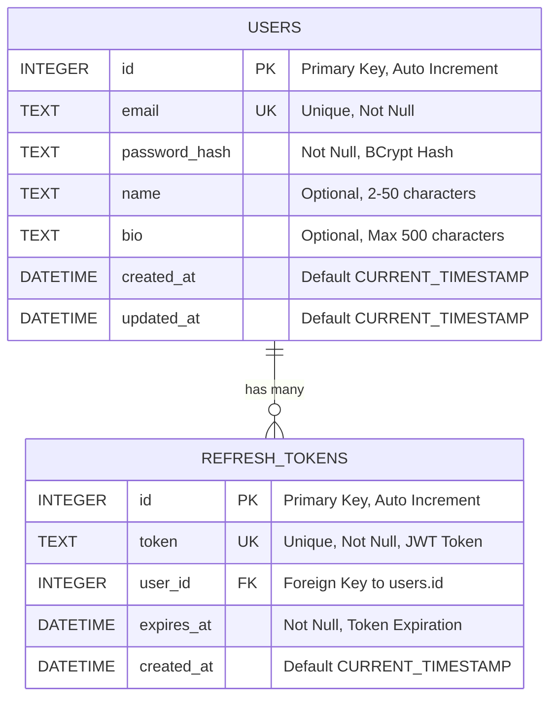

# Database Schema Documentation

This document describes the database schema for the Colbin User Management System.

## Database Overview

- **Database Engine**: SQLite (development) / PostgreSQL (production recommended)
- **Location**: `backend/database/users.db`
- **Character Set**: UTF-8
- **Collation**: NOCASE for case-insensitive text comparisons

## Entity Relationship Diagram



## Table Definitions

### users

Stores user account information and profile data.

```sql
CREATE TABLE users (
    id INTEGER PRIMARY KEY AUTOINCREMENT,
    email TEXT UNIQUE NOT NULL,
    password_hash TEXT NOT NULL,
    name TEXT,
    bio TEXT,
    created_at DATETIME DEFAULT CURRENT_TIMESTAMP,
    updated_at DATETIME DEFAULT CURRENT_TIMESTAMP
);
```

#### Columns

| Column | Type | Constraints | Description |
|--------|------|-------------|-------------|
| `id` | INTEGER | PRIMARY KEY, AUTOINCREMENT | Unique user identifier |
| `email` | TEXT | UNIQUE, NOT NULL | User's email address (used for login) |
| `password_hash` | TEXT | NOT NULL | BCrypt hashed password (never store plaintext) |
| `name` | TEXT | NULLABLE | User's display name (2-50 characters) |
| `bio` | TEXT | NULLABLE | User's biography (max 500 characters) |
| `created_at` | DATETIME | DEFAULT CURRENT_TIMESTAMP | Account creation timestamp |
| `updated_at` | DATETIME | DEFAULT CURRENT_TIMESTAMP | Last profile update timestamp |

#### Indexes

```sql
-- Automatically created by UNIQUE constraint
CREATE UNIQUE INDEX sqlite_autoindex_users_1 ON users(email);

-- Additional indexes for performance (optional)
CREATE INDEX idx_users_created_at ON users(created_at);
CREATE INDEX idx_users_updated_at ON users(updated_at);
```

#### Validation Rules

- **email**: Must be valid email format, case-insensitive unique
- **password_hash**: BCrypt hash with salt rounds = 12
- **name**: 2-50 characters, letters and spaces only (if provided)
- **bio**: Maximum 500 characters (if provided)

#### Sample Data

```sql
INSERT INTO users (email, password_hash, name, bio) VALUES
(
    'john.doe@example.com',
    '$2a$12$LQv3c1yqBWVHxkd0LHAkCOYz6TtxMQJqhN8/LewdBPj/pJx8BL5tS',
    'John Doe',
    'Software developer passionate about creating great user experiences.'
);
```

### refresh_tokens

Stores refresh tokens for JWT authentication system.

```sql
CREATE TABLE refresh_tokens (
    id INTEGER PRIMARY KEY AUTOINCREMENT,
    token TEXT UNIQUE NOT NULL,
    user_id INTEGER NOT NULL,
    expires_at DATETIME NOT NULL,
    created_at DATETIME DEFAULT CURRENT_TIMESTAMP,
    FOREIGN KEY (user_id) REFERENCES users (id) ON DELETE CASCADE
);
```

#### Columns

| Column | Type | Constraints | Description |
|--------|------|-------------|-------------|
| `id` | INTEGER | PRIMARY KEY, AUTOINCREMENT | Unique token record identifier |
| `token` | TEXT | UNIQUE, NOT NULL | JWT refresh token string |
| `user_id` | INTEGER | NOT NULL, FK | Reference to users.id |
| `expires_at` | DATETIME | NOT NULL | Token expiration timestamp |
| `created_at` | DATETIME | DEFAULT CURRENT_TIMESTAMP | Token creation timestamp |

#### Foreign Keys

```sql
-- Cascade delete: when user is deleted, all their refresh tokens are deleted
FOREIGN KEY (user_id) REFERENCES users (id) ON DELETE CASCADE
```

#### Indexes

```sql
-- Automatically created by UNIQUE constraint
CREATE UNIQUE INDEX sqlite_autoindex_refresh_tokens_1 ON refresh_tokens(token);

-- Additional indexes for performance
CREATE INDEX idx_refresh_tokens_user_id ON refresh_tokens(user_id);
CREATE INDEX idx_refresh_tokens_expires_at ON refresh_tokens(expires_at);
```

#### Token Lifecycle

1. **Creation**: When user logs in or refreshes token
2. **Validation**: Check if token exists and not expired
3. **Refresh**: Old token deleted, new token created
4. **Expiration**: Automatic cleanup of expired tokens (recommended)
5. **Logout**: Token immediately deleted

#### Sample Data

```sql
INSERT INTO refresh_tokens (token, user_id, expires_at) VALUES
(
    'eyJhbGciOiJIUzI1NiIsInR5cCI6IkpXVCJ9.eyJ1c2VySWQiOjEsImlhdCI6MTY5NTM3MjYwMCwiZXhwIjoxNjk1OTc3NDAwfQ.example',
    1,
    datetime('now', '+7 days')
);
```

## Database Operations

### Common Queries

#### User Operations

```sql
-- Create user
INSERT INTO users (email, password_hash, name, bio) 
VALUES (?, ?, ?, ?);

-- Find user by email
SELECT id, email, password_hash, name, bio, created_at, updated_at 
FROM users 
WHERE email = ? COLLATE NOCASE;

-- Update user profile
UPDATE users 
SET name = ?, bio = ?, email = ?, updated_at = datetime('now') 
WHERE id = ?;

-- Delete user (cascades to refresh_tokens)
DELETE FROM users WHERE id = ?;

-- Get user profile (without password)
SELECT id, email, name, bio, created_at, updated_at 
FROM users 
WHERE id = ?;
```

#### Token Operations

```sql
-- Store refresh token
INSERT INTO refresh_tokens (token, user_id, expires_at) 
VALUES (?, ?, datetime('now', '+7 days'));

-- Validate refresh token
SELECT rt.*, u.id as user_id 
FROM refresh_tokens rt
JOIN users u ON rt.user_id = u.id
WHERE rt.token = ? AND rt.expires_at > datetime('now');

-- Remove refresh token
DELETE FROM refresh_tokens WHERE token = ?;

-- Clean expired tokens (maintenance)
DELETE FROM refresh_tokens WHERE expires_at <= datetime('now');

-- Remove all user tokens (logout all devices)
DELETE FROM refresh_tokens WHERE user_id = ?;
```

### Database Maintenance

#### Periodic Cleanup

```sql
-- Remove expired refresh tokens (run daily)
DELETE FROM refresh_tokens 
WHERE expires_at <= datetime('now', '-1 day');

-- Vacuum database (optimize storage)
VACUUM;

-- Analyze tables (update query planner statistics)
ANALYZE;
```

#### Backup Strategy

```bash
# SQLite backup
sqlite3 users.db ".backup backup_$(date +%Y%m%d_%H%M%S).db"

# Restore from backup
sqlite3 users.db ".restore backup_20230922_143000.db"
```

## Migration Scripts

### Initial Schema Creation

```sql
-- Version 1.0.0 - Initial schema
PRAGMA foreign_keys = ON;

CREATE TABLE IF NOT EXISTS users (
    id INTEGER PRIMARY KEY AUTOINCREMENT,
    email TEXT UNIQUE NOT NULL,
    password_hash TEXT NOT NULL,
    name TEXT,
    bio TEXT,
    created_at DATETIME DEFAULT CURRENT_TIMESTAMP,
    updated_at DATETIME DEFAULT CURRENT_TIMESTAMP
);

CREATE TABLE IF NOT EXISTS refresh_tokens (
    id INTEGER PRIMARY KEY AUTOINCREMENT,
    token TEXT UNIQUE NOT NULL,
    user_id INTEGER NOT NULL,
    expires_at DATETIME NOT NULL,
    created_at DATETIME DEFAULT CURRENT_TIMESTAMP,
    FOREIGN KEY (user_id) REFERENCES users (id) ON DELETE CASCADE
);

-- Create indexes
CREATE INDEX IF NOT EXISTS idx_users_email ON users(email);
CREATE INDEX IF NOT EXISTS idx_refresh_tokens_user_id ON refresh_tokens(user_id);
CREATE INDEX IF NOT EXISTS idx_refresh_tokens_expires_at ON refresh_tokens(expires_at);
```

### Future Migration Example

```sql
-- Version 1.1.0 - Add user preferences
ALTER TABLE users ADD COLUMN preferences TEXT DEFAULT '{}';
ALTER TABLE users ADD COLUMN email_verified BOOLEAN DEFAULT FALSE;
ALTER TABLE users ADD COLUMN last_login_at DATETIME;

-- Create email verification tokens table
CREATE TABLE email_verification_tokens (
    id INTEGER PRIMARY KEY AUTOINCREMENT,
    user_id INTEGER NOT NULL,
    token TEXT UNIQUE NOT NULL,
    expires_at DATETIME NOT NULL,
    created_at DATETIME DEFAULT CURRENT_TIMESTAMP,
    FOREIGN KEY (user_id) REFERENCES users (id) ON DELETE CASCADE
);
```

## Production Considerations

### PostgreSQL Migration

```sql
-- PostgreSQL equivalent schema
CREATE TABLE users (
    id SERIAL PRIMARY KEY,
    email VARCHAR(255) UNIQUE NOT NULL,
    password_hash VARCHAR(255) NOT NULL,
    name VARCHAR(100),
    bio TEXT,
    created_at TIMESTAMP DEFAULT CURRENT_TIMESTAMP,
    updated_at TIMESTAMP DEFAULT CURRENT_TIMESTAMP
);

CREATE TABLE refresh_tokens (
    id SERIAL PRIMARY KEY,
    token TEXT UNIQUE NOT NULL,
    user_id INTEGER NOT NULL REFERENCES users(id) ON DELETE CASCADE,
    expires_at TIMESTAMP NOT NULL,
    created_at TIMESTAMP DEFAULT CURRENT_TIMESTAMP
);

-- Indexes
CREATE INDEX idx_users_email ON users(email);
CREATE INDEX idx_refresh_tokens_user_id ON refresh_tokens(user_id);
CREATE INDEX idx_refresh_tokens_expires_at ON refresh_tokens(expires_at);

-- Triggers for updated_at
CREATE OR REPLACE FUNCTION update_updated_at_column()
RETURNS TRIGGER AS $$
BEGIN
    NEW.updated_at = CURRENT_TIMESTAMP;
    RETURN NEW;
END;
$$ language 'plpgsql';

CREATE TRIGGER update_users_updated_at 
    BEFORE UPDATE ON users 
    FOR EACH ROW 
    EXECUTE FUNCTION update_updated_at_column();
```

### Performance Optimization

#### Connection Pooling

```javascript
// SQLite with better-sqlite3 for production
const Database = require('better-sqlite3');
const db = new Database('users.db', {
    verbose: console.log,
    fileMustExist: true
});

// Prepare statements for better performance
const statements = {
    getUserByEmail: db.prepare('SELECT * FROM users WHERE email = ? COLLATE NOCASE'),
    createUser: db.prepare('INSERT INTO users (email, password_hash, name, bio) VALUES (?, ?, ?, ?)'),
    updateUser: db.prepare('UPDATE users SET name = ?, bio = ?, email = ?, updated_at = datetime("now") WHERE id = ?')
};
```

#### Query Optimization

```sql
-- Use EXPLAIN QUERY PLAN to analyze queries
EXPLAIN QUERY PLAN 
SELECT * FROM users u 
JOIN refresh_tokens rt ON u.id = rt.user_id 
WHERE u.email = 'user@example.com' AND rt.expires_at > datetime('now');

-- Add covering indexes for frequently accessed columns
CREATE INDEX idx_users_email_name ON users(email, name, id);
```

### Security Considerations

#### Data Protection

```sql
-- Enable foreign key constraints
PRAGMA foreign_keys = ON;

-- Set secure permissions (filesystem level)
-- chmod 600 users.db
-- chown app:app users.db

-- Regular integrity checks
PRAGMA integrity_check;
PRAGMA foreign_key_check;
```

#### Audit Trail (Future Enhancement)

```sql
-- Audit table for tracking changes
CREATE TABLE user_audit (
    id INTEGER PRIMARY KEY AUTOINCREMENT,
    user_id INTEGER NOT NULL,
    action TEXT NOT NULL, -- 'INSERT', 'UPDATE', 'DELETE'
    old_values TEXT, -- JSON
    new_values TEXT, -- JSON
    changed_by INTEGER, -- admin user id
    changed_at DATETIME DEFAULT CURRENT_TIMESTAMP
);
```

## Monitoring and Maintenance

### Health Checks

```sql
-- Database connectivity test
SELECT 1 as health_check;

-- Table existence check
SELECT name FROM sqlite_master WHERE type='table';

-- Row counts
SELECT 
    'users' as table_name, 
    COUNT(*) as row_count 
FROM users
UNION ALL
SELECT 
    'refresh_tokens' as table_name, 
    COUNT(*) as row_count 
FROM refresh_tokens;
```

### Performance Metrics

```sql
-- Database size
SELECT page_count * page_size as size_bytes 
FROM pragma_page_count(), pragma_page_size();

-- Index usage statistics (SQLite 3.38+)
SELECT * FROM pragma_index_list('users');
SELECT * FROM pragma_index_info('idx_users_email');
```

This schema provides a solid foundation for user management with proper relationships, constraints, and performance considerations while maintaining simplicity and scalability options for future growth.
